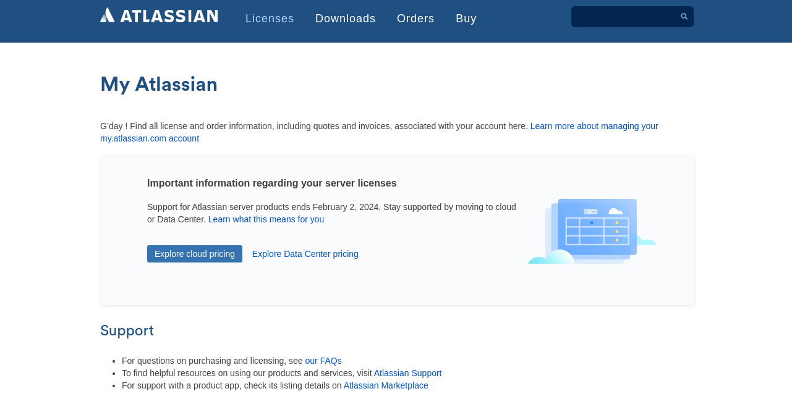
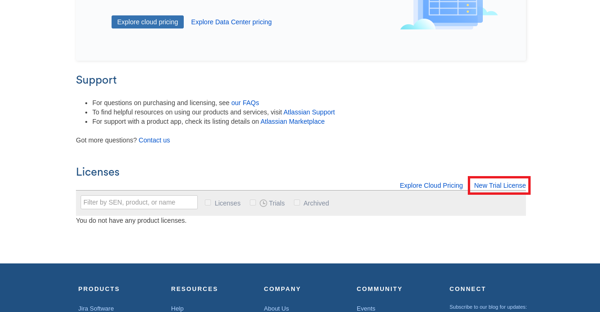
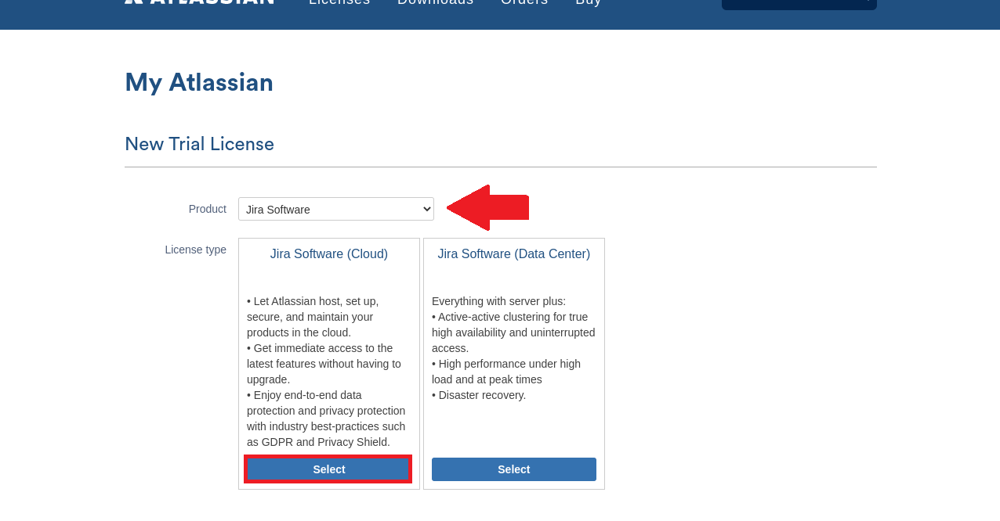
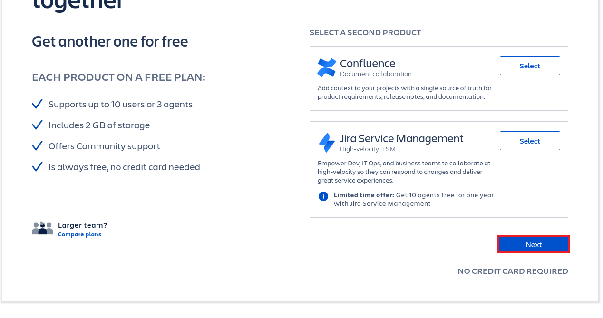
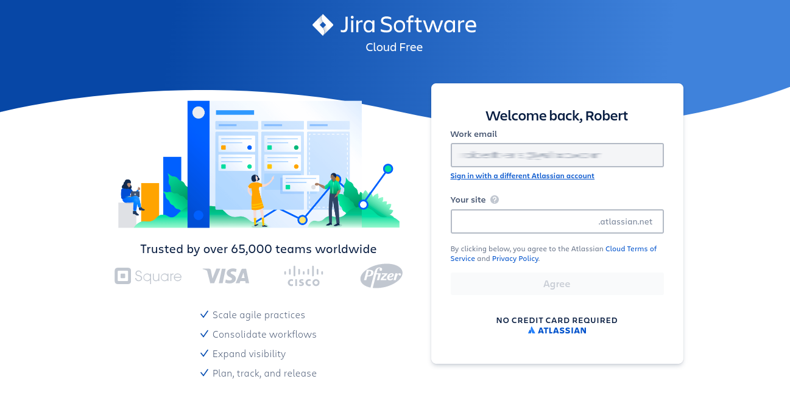
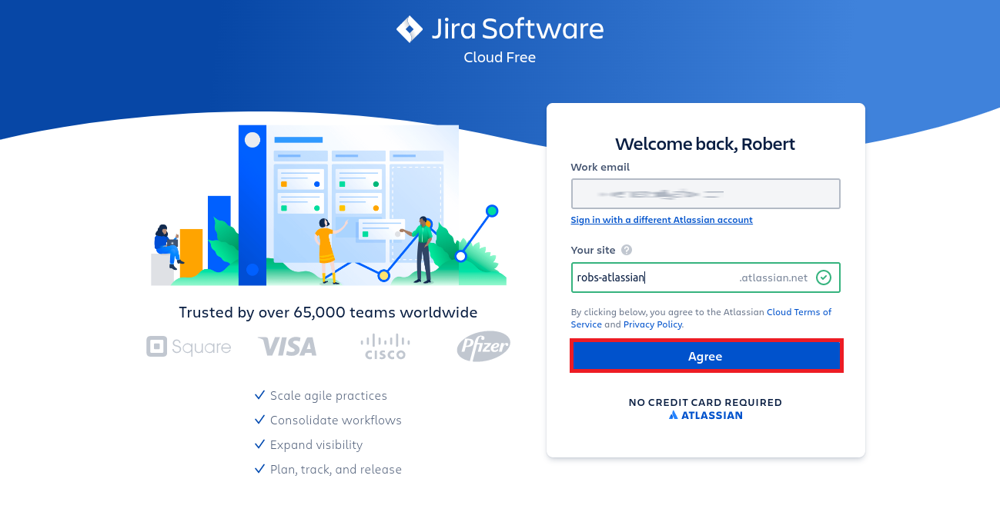
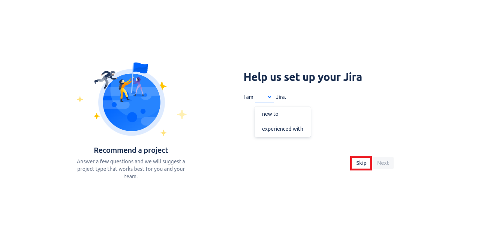

### Obtaining an Atlassian Trial License

If you don't have an existing Atlassian account, head [here](https://id.atlassian.com/signup) to sign up for an account. You'll have to provide an email address and perform a validation check. Once you've complete that, you'll be taken to the following screen.

Scroll down and click **New Trial License**.

On the next screen, be sure to choose **Jira Software** from the dropdown. Select the **Cloud** option.

On the next screen, select any additional products you'd like to add to the trial, and then click **Next**.

On the next screen, choose a name for your site, and enter it in the box beneath **Your site**. You'll use the fqdn shown in the box when you configure FortiDevSec to integrate with JIRA.

Click **Agree**.

The next screen will begin a series of questions Atlassian will ask to customize your environment according to certain preferences. You may skip this by clicking **Skip**.

For the purposes of the TEC Recipe, you'll need to configure a bug-tracking project. Chapter 1 of the recipe will talk you through doing so.
