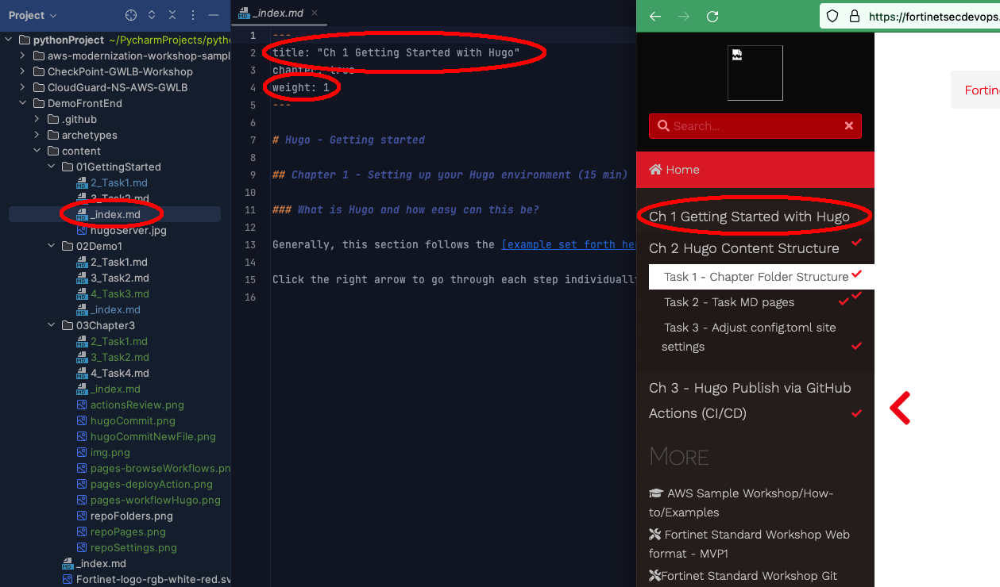

### Create a Folder structure correlating to the major topics/sections of the demonstration

1. Browse to the **content** directory within your TECWorkshop repo (Locally on your machine)
  * The Left Hand navigation menu is driven by the folder structure you create
  * Chapters are ordered according to the number prefix on the folder
    * _Folder Naming doesn't appear on the published site, it only helps the content creator organize the chapters & remember what's in each Chapter_

2. Within each folder there is an **_index.md** file which is used to create the content of the Chapter header page
  * The **_index.md** is used to
    1. title the Chapter header page in left hand navigation
    2. display chapter introduction content on the chapter heading page
  * Notice the folder structure and file naming on the left and the resulting display on the right
  {} Note that the file and folder names only matter for ordering in your directory listing.  Lower numbered folders will appear first.  Only the "title" tags within each Markdown file will impact the resulting page view {}

  * 

3. Subsequent Markdown pages under each folder are used to explain tasks/steps within each chapter
  