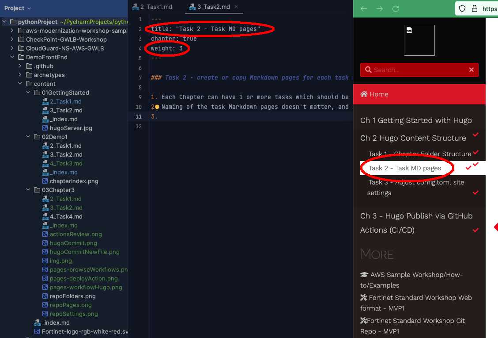

### Create or copy Markdown pages for each task within the chapter 

1. Each Chapter can have 1 or more tasks which should be completed by the participants 
2. Naming of the task Markdown pages doesn't matter, and is only used to aid the content author in organizing the content.
    {} Note that the filename doesn't matter other than to help organize content.  The Title and Weight dictate the leftnav visual and ordering of the pages.  Lower weight pages are displayed first{}
    


{} Because the file and folder names are very similar in our example repo, it can become confusing to know where to make edits.  Make sure you're editing the correct file in your IDE/editor {}

3. This page contains several useful markdown shortcodes you can use for visual pop-outs on the the site

###  [Lots of shortcodes & Features available here](https://mcshelby.github.io/hugo-theme-relearn/shortcodes/index.html)

- [Badges](https://mcshelby.github.io/hugo-theme-relearn/shortcodes/badge/index.html): 

    {}Important{}
    {}6.6.6{}
    {}Captain{}
    {}New{}
    {}Awesome{}

- [Icons](https://mcshelby.github.io/hugo-theme-relearn/shortcodes/icon/index.html):

    :star: Tips this is a star
    :bulb: this is a lightbulb
    {}
    {}
    {}

- [Notices](https://mcshelby.github.io/hugo-theme-relearn/shortcodes/notice/index.html)

    {} this is a note box {}
    {} this is a tip box {}
    {} this is a tip box {}
    {} The examples and sample code provided in this workshop are intended to be consumed as instructional content. These will help you understand how various Fortinet and Azure services can be architected to build a solution while demonstrating best practices along the way. These examples are not intended for use in production environments without full understanding of how they operate. {}

- [Expandable sections](https://mcshelby.github.io/hugo-theme-relearn/shortcodes/expand/index.html)":

    {}Thank you!{}

- [Buttons](https://mcshelby.github.io/hugo-theme-relearn/shortcodes/button/index.html):

    {}Get Hugo{}
    {}Get Hugo{}

- [Mermaid (diagrams & charts)](https://mcshelby.github.io/hugo-theme-relearn/shortcodes/mermaid/index.html):

    ```mermaid { align="center" zoom="true" }
        graph LR;
            If --> Then
            Then --> Else
    ```

    
%%{init:{"theme":"forest"}}%%
graph LR;
    A[Hard edge] -->|Link text| B(Round edge)
    B --> C{<strong>Decision</strong>}
    C -->|One| D[Result one]
    C -->|Two| E[Result two]




%%{init:{"fontFamily":"monospace", "sequence":{"showSequenceNumbers":true}}}%%
sequenceDiagram
    Alice->>John: Hello John, how are you?
    loop Healthcheck
        John->>John: Fight against hypochondria
    end
    Note right of John: Rational thoughts!
    John-->>Alice: Great!
    John->>Bob: How about you?
    Bob-->>John: Jolly good!
