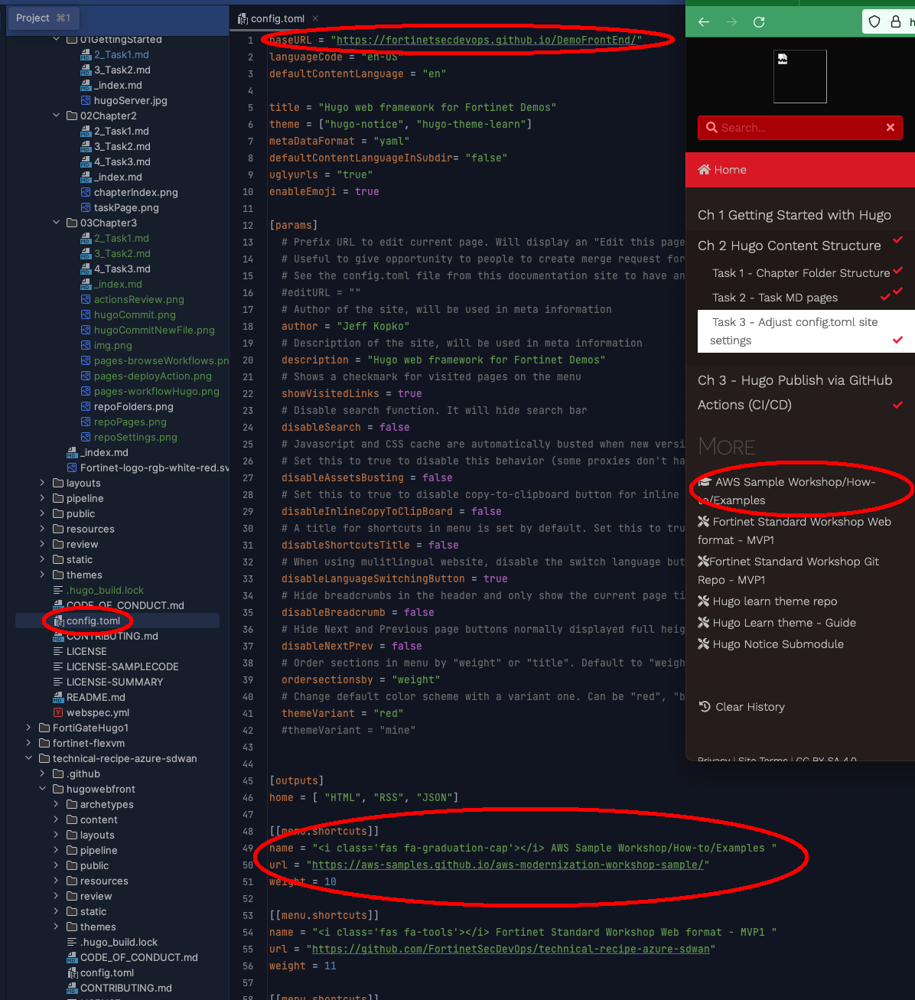

### Adjust the Site's [Frontmatter](https://gohugo.io/content-management/front-matter/) in config.toml file 
{} Config.toml must be modified for each new repo as it controls overall parameters for the site {}
1. Open the **config.toml** file under the repo root to change a few parameters of the site
   - Edit the **baseUrl** parameter to match the GitHub Page for your site (**it will match your TECWorkshop reop name**)
   - Edit the **themeVariant** parameter depending on the type of TEC Content you're using
   
{}  Currently available themeVariants are:
- Workshop
- Demo
- UseCase
- Spotlight
{}
      
   - Optionally Edit the **logoBannerText** parameter, if you want to override the themeVariant Text under Fortinet Logo
   - Optionally Edit the **logoBannerSubText** parameter, if you want to add description under Banner Text
   - Add additional resource URL's to the bottom of the left menu bar with **[[menu.shortcuts]]**
     - menu.shortcuts are displayed lowest to highest according to their weight
   - Additional customizations can be made with **themeVariants**, so email [fortinetcloudcse@fortinet.com](mailto:fortinetcloudcse@fortinet.com) to request global site changes
  
