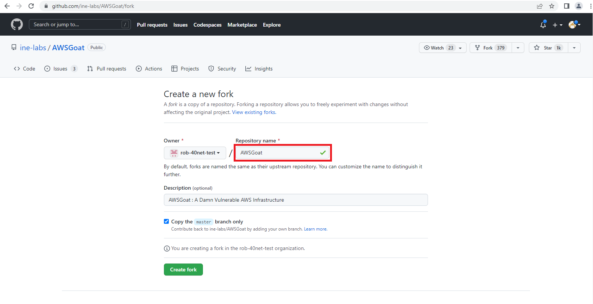

#### Set Up the Application Repository

Navigate to the AWS Goat application [homepage](https://github.com/ine-labs/AWSGoat), and click 'Fork' near the top right of the page.


Enter a name for your forked version of the repo, make sure the **Copy the master branch only** box is checked, and click **Create fork**.




At the github repository homepage for your newly **forked** repository, click the green **Code** dropdown, click the 'HTTPS' tab, and copy the url to the clipboard.


From a command line, issue the following commands to clone the repo locally and navigate to the top-level directory:

```sh
git clone <url copied above>
cd AWSGoat
```

Navigate your browser to the FortiDevSec [https://fortidevsec.forticloud.com/](https://fortidevsec.forticloud.com/) console and click the login button at the top right of the screen.


Enter your Fortinet Support credentials. 


Once successfully logged in, you are taken to the main FortiDevSec dashboard.


Click **New Application** at the top right of the dashboard screen, and the 'New Application' modal will appear.


Select a name for the application, and click **Next**.


Specify the risk rating factors. These are based on the [OWASP Risk Rating Methodology](https://owasp.org/www-community/OWASP_Risk_Rating_Methodology) and are used to adjust the weights on the risk scores for vulnerabilities found in your application based on its exposure and criticality. For our purposes, select **7 - Severe** and **9 - Internet** in the first and second dropdowns respectively, and click **Next**.


Ensure **Add Jira Plugin** is not enabled, as in the image below. Click **Next**.


Ensure **FortiDAST App Config** is not enabled, as in the image below. We will be doing a DAST scan later in the workshop, but we'll need to deploy the application and retrieve it's unique URL first. 


The application ID will be displayed on the next screen. Click **SCANNER CONFIG** to download the **fdevsec.yaml** configuration file. Then be sure to click **Done** at the bottom of the modal.


Copy the downloaded **fdevsec.yaml** to the top level directory of the application that was cloned in an earlier step. The sample command below assumes the fdevsec.yaml file has been downloaded to the local downloads folder inside the home directory and also that the AWSGoat repo has been cloned to the local home directory.

```sh
cp ~/Downloads/fdevsec.yaml ~/AWSGoat
```
