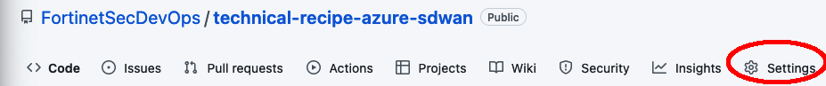
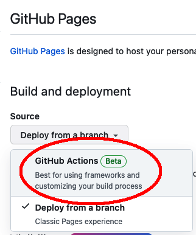
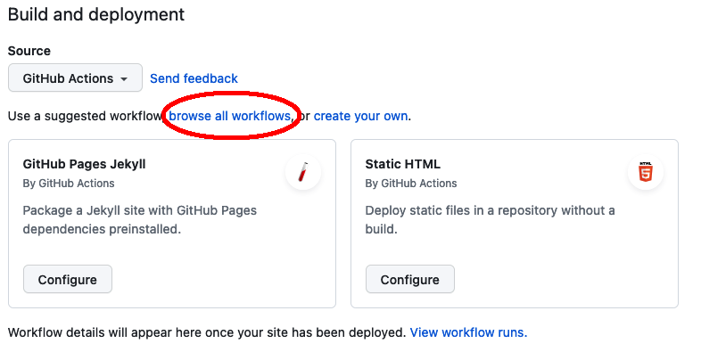
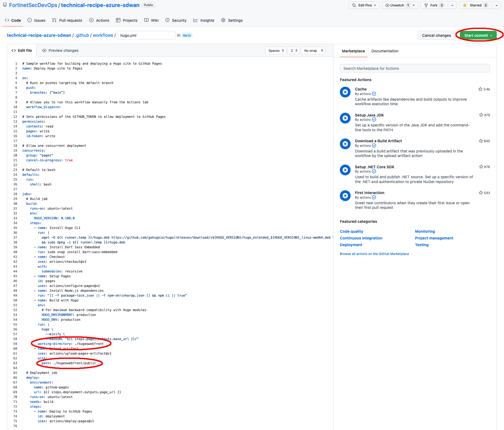
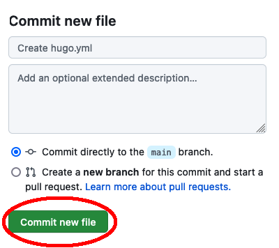
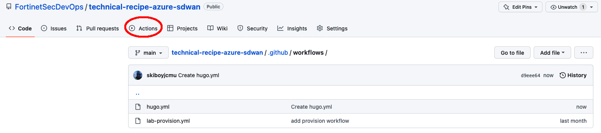

### Create GitHub action for Hugo Publish 

{}  You must have proper repo permissions to setup a GitHub action.  If you do not see the settings button on the top repo banner/ribbon, please reach out to the repo owner to get the proper permissions {}

1. In your web browser, navigate to the GitHub repo and click on **Settings** in the top ribbon 

2. On the left hand nav bar, click on **Pages**

3. Under **Source** select **GitHub Actions**

4. Click **Browse All Workflows**

5. Search for **Hugo** and then click **Configure** under the Hugo GitHub Actions

6. You'll see a hugo.yml file created, which directs GitHubActions to execute a Hugo Build Command anytime the repo is updated.  We need to make 1 minor adjustment to this file.  B/c we located our hugo content underneath the repo root, we need to tell hugo where it needs to build and publish. Once updated per your folder naming in the spots shown below, click **Start Commit**

Specifically, you want to add a **working-directory** under the **jobs: --> build: --> steps: section** and then update the **Upload Artifact** path.  You can copy and paste this entire script into your hugo.yml file, or just edit the specific lines for working directory (in the bottom 1/3 of the file)

``` yml
# Sample workflow for building and deploying a Hugo site to GitHub Pages
name: Deploy Hugo site to Pages

on:
  # Runs on pushes targeting the default branch
  push:
    branches: ["main"]

  # Allows you to run this workflow manually from the Actions tab
  workflow_dispatch:

# Sets permissions of the GITHUB_TOKEN to allow deployment to GitHub Pages
permissions:
  contents: read
  pages: write
  id-token: write

# Allow one concurrent deployment
concurrency:
  group: "pages"
  cancel-in-progress: true

# Default to bash
defaults:
  run:
    shell: bash

jobs:
  # Build job
  build:
    runs-on: ubuntu-latest
    env:
      HUGO_VERSION: 0.108.0
    steps:
      - name: Install Hugo CLI
        run: |
          wget -O ${{ runner.temp }}/hugo.deb https://github.com/gohugoio/hugo/releases/download/v${HUGO_VERSION}/hugo_extended_${HUGO_VERSION}_linux-amd64.deb \
          && sudo dpkg -i ${{ runner.temp }}/hugo.deb
      - name: Install Dart Sass Embedded
        run: sudo snap install dart-sass-embedded
      - name: Checkout
        uses: actions/checkout@v3
        with:
          submodules: recursive
      - name: Setup Pages
        id: pages
        uses: actions/configure-pages@v2
      - name: Install Node.js dependencies
        run: "[[ -f package-lock.json || -f npm-shrinkwrap.json ]] && npm ci || true"
      - name: Build with Hugo
        env:
          # For maximum backward compatibility with Hugo modules
          HUGO_ENVIRONMENT: production
          HUGO_ENV: production
        run: |
          hugo \
            --minify \
            --baseURL "${{ steps.pages.outputs.base_url }}/"
        working-directory: ./hugeowebfront
      - name: Upload artifact
        uses: actions/upload-pages-artifact@v1
        with:
          path: ./hugeowebfront/public

  # Deployment job
  deploy:
    environment:
      name: github-pages
      url: ${{ steps.deployment.outputs.page_url }}
    runs-on: ubuntu-latest
    needs: build
    steps:
      - name: Deploy to GitHub Pages
        id: deployment
        uses: actions/deploy-pages@v1

```

7. Click to **Commit new file**

8. You'll see the new GitHub action file **hugo.yml** created in the .github/workflows folder of the repo.  You can review the action to see results of the build

