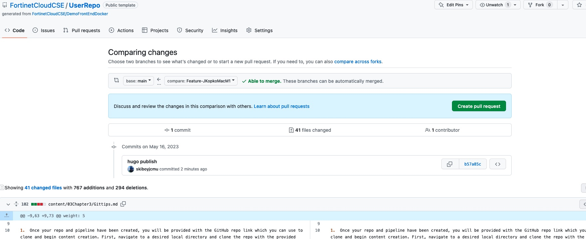
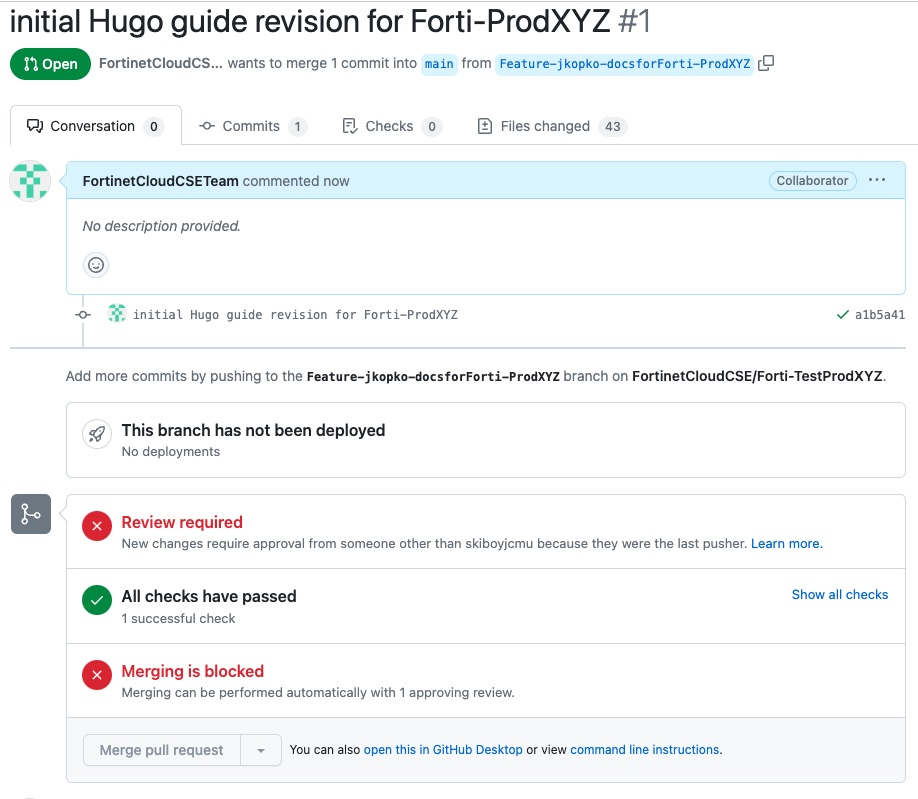

## GitHub Repo Getting Started (General Workflow for GitHub Repos)

1.  Once your repo and pipeline have been created, you will be provided with the GitHub repo link which you can use to clone and begin content creation. First, navigate to a desired local directory and clone the repo with the provided link:

      ```shell
        cd <desired parent directory>
        git clone <provided link>
        cd <cloned repo directory>
      ```
2. Create a feature branch to begin working on your desired changes.

      ```shell
        git checkout -b <FEATURE-username-ShortDescr>
      ```

3. Check the repo status to verify the changes to be staged.

      ```shell
        git status
      ```

4. When you have changes, Stage the desired files (or issue -A (or .) for all), commit, and push.

      ```shell
        git add -A {or} git add .
        git commit -m "<add a commit message here>"
        git push
      ```
   
   - If this is your first push to the branch, GitHub upstream doesn't know about it.  Just go ahead and use the provided command in this case to perform the push, which will create the upstream branch
       - To auto create new branches when you first push, update Git global config 

         ```shell
          git config --global --add --bool push.autoSetupRemote true
         ```
         
   - Tip: If you have a number of small commits and don't want them and their associated commit messages polluting the git log, you can squash your commits by performing a soft reset:
       
     ```shell
        git reset --soft <hash of the last commit you want to keep as is>
        git add -A
        git commit -m "<new commit message>"
        git log
     ```
       - You will see the new commit on top of the one you referenced in the git reset command.

5. When you have completed your work and are ready to merge your changes into the main branch, ensure your branch is up-to-date with the main branch.

      ```shell 
          # locally checkout the main branch
        git checkout main
          # pull the latest version of main from GitHub to your local repo 
        git pull
          # locally checkout your feature branch
        git checkout <branch>
          # locally perform an interactive rebase which locally pulls commits from main into my branch
        git rebase main -i 
          # push my local branch (which now includes the latest changes from GH main) up to GitHub remote
        git push --force
      ``` 

   - Create a PR on GitHub, being sure to select your branch to merge with main. Wait for approval
   
       
     - You will not be able to merge the the PR until receiving approval from Jeff or Rob
       
  - Once your PR is approved, checkout the main branch and perform a fast-forward merge and force push to complete the workflow.
  
      ```shell 
        # locally checkout the main branch
        git checkout main
        # locally merge myFeatureBranch into main with a fast-forward merge scheme
        git merge <feature branch name> --ff-only
        # push local main (which now has myFeatureBranch merged into it) up to GitHub remote  
        # because this push includes the merge it will auto close the PullRequest
        git push
      ```
    
6. Branch cleanup - generally you can reuse your branch while actively developing.  If you want to close your branch, use the following commands
    ```shell
      # delete the branch locally 
      git branch -D feature-branch
      # tell GH remote about branch deletion
      git push origin --delete feature-branch
   ``` 

