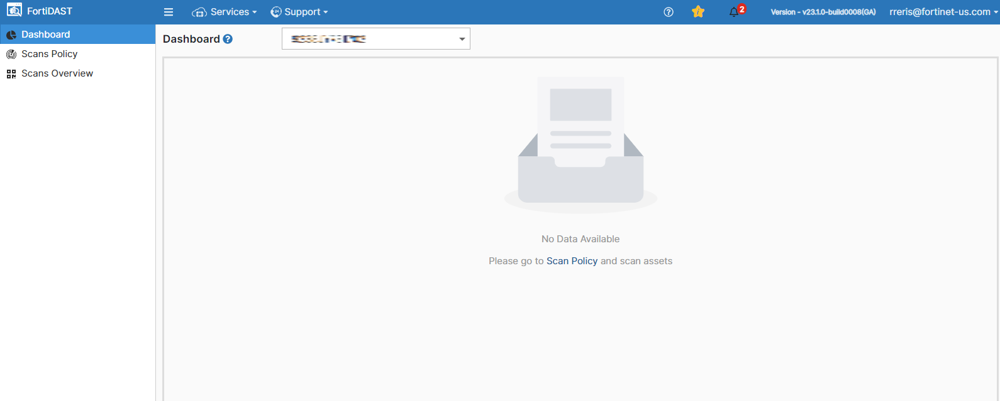
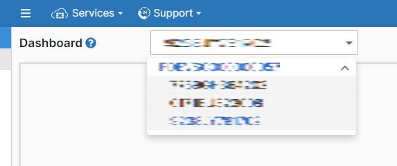
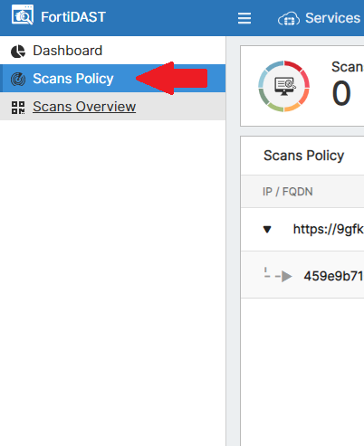
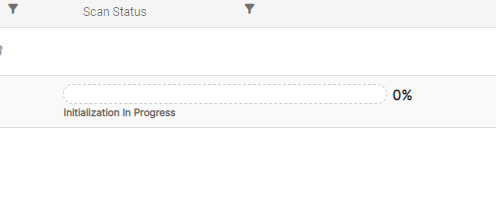
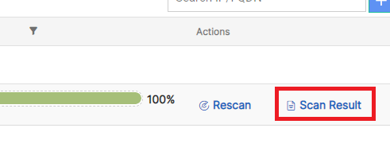
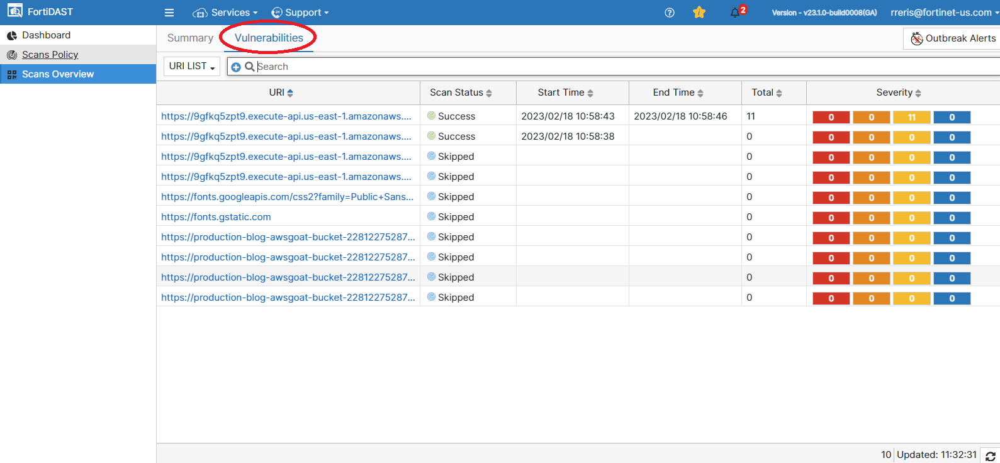
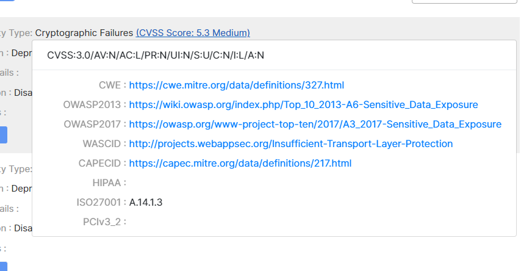

### DAST Scan

First, open up your command line interface and navigate to the application top-level directory.

```sh
cd ~/AWSGoat
```

Open up the fdevsec.yaml file and modify it as below, removing previous configuration settings for the SAST, SCA, container, IaC, and Secrets scans, and adding settings for the DAST scan. You'll need the application URL you noted down in Chapter 1.

```sh
version: v1

id:
  org: <Org ID>
  app: <App ID>

scanners:
  - dast

dast:
  url: <your app url, i.e. https://api-id.execute-api.us-east-1.amazonaws.com/prod/react>
  full_scan: false
```

Now, open up a web browser and navigate to the FortiDAST console: [https://fortidast.forticloud.com](https://fortidast.forticloud.com).




In the dropdown, click the FortiDevSec license beginning with "FDEVSC" and select your active license.



Now, return to the command line, and ensure Docker is running.

```sh
docker --version
> Docker version 20.10.21, build baeda1f
```

Run the following command to begin the DAST scan.

```sh
docker run --rm --mount type=bind,source="$PWD",target=/scan registry.fortidevsec.forticloud.com/fdevsec_dast:latest
```

If the command runs successfully, you'll see the following output:


Now, open up the FortiDAST console in your browser and click **Scans Policy** on the left hand sidebar.



You should see the application URL along with it's current Authorization Status and Scan Status. Click the ellipsis box on the right hand side, and click **Authorize**.


You'll see the Authorization status change to **Authorizing**, and once complete, it will change to **Authorized**.
     

If you click **Configure**, you'll see options for naming the scan, specifying an alternate port, scheduling the scan for a future date/time, and several other options for authentication, coverage, and other options.


Click the exit button ("x") at the top right to exit the **Configure** modal.

Click **Scan** to begin the application scan.


Once the scan starts, it's progress will be shown under **Scan Status**. The scan will take in upwards of thirty minutes to complete.



When the scan is complete (at 100%), click **Scan Result**.



This will take you to the **Scans Overview** page. The **Summary** tab displays scan details such as URI, scan date and time, scan status, CVSS score, and OWASP top 10 vulnerability scores.


The **Vulnerabilities** tab lists all of the links FortiDAST found in the application and the results of scanning each. Clicking on the main entrypoint URI opens a modal offering additional information on each vulnerability found.



On the **Summary** tab, hover over the Success portion of the **Scan Status** donut chart, and click the left mouse button.


This takes you to the vulnerabilities tab and creates a filter 'Scan Status == Success' and displays the URIs satisfying the filter's criteria. Click on the URI indicating 11 vulnerabilities.


This opens a modal with detailed information on each vulnerability, including steps to take to remediate the vulnerability as well as CVSS score and metric information. Click on the CVSS score on the first vulnerability listed.


This displays information and links to more information about the vulnerability found in various resources such as the MITRE CWE list, recent OWASP top ten lists, CAPECID, and WASCID databases.



Click the exit button ("x") at the top right of the modal to exit it.
